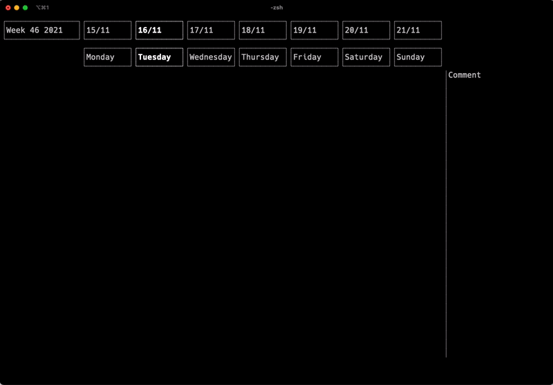

# Timekeeper




Timekeeper is a terminal-based timekeeping application for tracking hours worked.

Keep track of your work without having to leave your work environment!

## Installation

On Mac, timekeeper can be installed via brew:

```bash
brew tap aslaksm/timekeeper
brew install timekeeper
```

For Linux and Windows, you currently have to build the binary yourself using Cargo.
